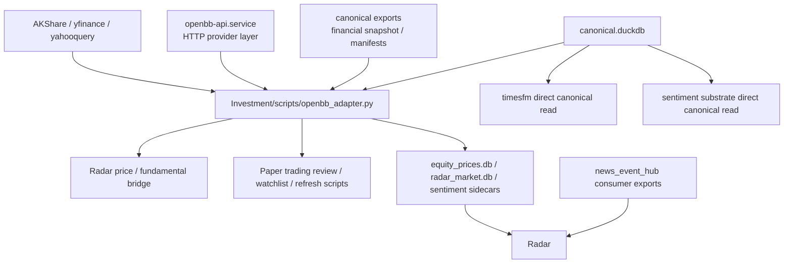
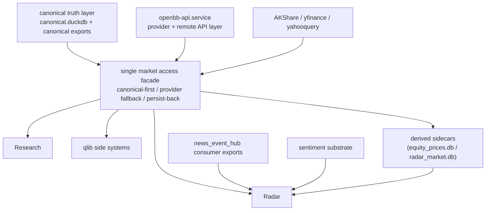

# Canonical Data Access Architecture

## 1. Question

当前真正的问题不是“有没有 canonical 数据库”，而是：

- `canonical 数据库`
- `OpenBB API`
- `Investment/scripts/openbb_adapter.py`
- `Radar / qlib / Research`

这几层之间的角色还没有完全收干净。

这份文档只回答一个问题：

`现在真实的数据调用链是什么？`
`最终应该收成什么样？`

如果要看进一步收敛后的目标分层与 `fact plane / signal plane` 设计，继续看：

- [fact_signal_target_architecture_v1.md](docs/fact_signal_target_architecture_v1.md)

## 2. Short Answer

当前真实状态不是：

`canonical DB -> OpenBB API -> 所有下游`

而是：

`canonical DB + OpenBB API + repo-native adapter + 若干直接查询`

混合并存。

更准确地说：

- `canonical.duckdb` 仍然是很多市场/财务事实的 truth source
- `openbb-api.service` 当前更像 provider / external API 层
- `Investment/scripts/openbb_adapter.py` 才是最接近“统一消费门面”的那一层
- 但部分下游仍然直接碰 `canonical.duckdb`
- 所以现在还没有真正做到 “所有下游统一通过 OpenBB 中间层消费 canonical”

## 3. Current Real Architecture

### 3.1 Core Layers

1. `canonical truth layer`
- `canonical.duckdb`
- canonical exports，例如：
  - `a_share/latest_financial_snapshot.csv`
- 这是共享事实层

2. `shared sidecar / substrate layer`
- `equity_prices.db`
- `radar_market.db`
- `news_event_hub` consumer exports
- sentiment CSV / DB
- 这是为下游运行效率准备的派生层

3. `provider / fetch layer`
- `openbb-api.service`
- `AKShare`
- `yfinance`
- `yahooquery`
- 这是补抓和外部连接层，不是唯一 truth source

4. `access facade layer`
- `Investment/scripts/openbb_adapter.py`
- 它当前同时负责：
  - 先读 canonical
  - canonical 缺口时回源补抓
  - 抓完后尝试写回 canonical

5. `downstream consumer layer`
- `industry_signal_radar`
- `qlib_paper_trading`
- `Research`

### 3.2 Current Real Call Graph

## 4. Evidence-Based Findings

### 4.1 `openbb-api.service` is not the sole canonical consumer facade

当前 remote runtime 上的 `openbb-api.service` 真实监听：

- `127.0.0.1:6900`

它暴露的主要是：

- `/api/v1/equity/price/historical`
- `/api/v1/equity/fundamental/income`
- `/api/v1/equity/fundamental/balance`
- `/api/v1/equity/fundamental/cash`
- 若干 economy / regulators endpoints

但 Radar 真实使用的 bridge，并不是直接依赖 `openbb/` 子工作区里的纯 HTTP client，而是配置成优先加载：

- `../scripts/openbb_adapter.py`
- `/opt/openbb-runtime/scripts/openbb_adapter.py`

所以当前生产链里的“OpenBB 中间层”，更准确地说是：

- `openbb_adapter.py`

而不只是：

- `openbb-api.service`

### 4.2 `openbb_adapter.py` is already a hybrid canonical-first facade

当前 `Investment/scripts/openbb_adapter.py` 已经同时包含：

- `CanonicalDBClient`
- `OpenBB HTTP client`
- `AKShare` A 股直连
- `yfinance / yahooquery` 港股与海外补抓

并且在 price / fundamental 上采用：

1. 先读 canonical
2. 没有再抓 provider
3. 抓到后再写回 canonical

所以它已经不是一个“纯 OpenBB HTTP adapter”，而更像：

`canonical-first market access facade`

### 4.3 Some downstreams still bypass the facade

当前还有一些路径没有完全走统一门面：

- `qlib_paper_trading/scripts/run_timesfm_subsystem.py`
  - 直接读 `canonical.duckdb -> market_daily_bars`
- `qlib_paper_trading/scripts/build_sentiment_factor_substrate.py`
  - 直接读 canonical 和 sidecar

这说明：

- 当前还不是“所有下游都统一经由 one facade”
- 仍然存在 direct DB read

### 4.4 Radar is now canonical-first, but not yet facade-only

Radar 现在已经做到：

- 事件层只吃 `News Event Hub`
- 情绪层只吃 sentiment system
- 市场层优先 canonical substrate
- 价格/财务缺口时主动回上游补抓

但它仍然通过 `openbb_adapter.py` 同时做：

- canonical read
- provider fetch
- persist back canonical

所以 Radar 不是“完全绕过 canonical”，而是：

- 已经 canonical-first
- 但还没有被一个更正式、单一的市场访问层完全包住

## 5. What To Keep

这些路径应该保留。

### 5.1 Keep `canonical.duckdb` as truth source

这个方向不该动。

理由：

- 它已经承接了 `market_daily_bars / financial_statement_facts / instrument registry`
- 也已经是多个下游共同依赖的底座

### 5.2 Keep `openbb_adapter.py` as the immediate facade seed

短期内最不该推倒重来的是这层。

理由：

- 它已经具备 canonical-first 语义
- 已经具备 provider fallback
- 已经具备 persist-back 逻辑
- Radar 当前也已经围绕它收口

但需要把它正式升级命名成更清楚的角色，例如：

- `market_access_facade.py`
- 或 `canonical_market_access.py`

### 5.3 Keep `openbb-api.service` as provider/API layer

它应该保留，但角色要更清楚：

- 提供统一 HTTP API
- 作为外部 provider 能力层
- 作为 MCP / remote tool layer

而不是让它承担“所有 canonical 消费都必须经过它”的假角色。

### 5.4 Keep exports / sidecars as derived read surfaces

例如：

- `a_share/latest_financial_snapshot.csv`
- `equity_prices.db`
- `radar_market.db`

这些不是 truth source，但对运行效率和稳态运行有价值。

## 6. What To Deprecate

这些路径应该逐步废掉。

### 6.1 Deprecate duplicated adapter definitions

当前至少存在两套 adapter 语义：

- `openbb/scripts/openbb_adapter.py`
- `Investment/scripts/openbb_adapter.py`

这会造成：

- 口径漂移
- 修一处漏一处
- 下游很难知道哪一份才是生产版

应收成：

- 只有一份生产版 facade
- 其他位置只保留 thin wrapper 或 import stub

### 6.2 Deprecate ad hoc direct DB reads in downstream runtime logic

对于运行中的下游系统，长期目标不应继续允许：

- Radar 自己直接拼 canonical 查询
- Research 自己直接碰 DuckDB
- qlib 子系统各自写一套 DB 访问逻辑

这些应该逐步收进统一 facade 或 canonical query layer。

### 6.3 Deprecate “consumer decides provider” logic

下游不应该自己决定：

- 今天用 AKShare
- 明天用 yfinance
- 后天用 OpenBB HTTP

provider selection 应该留在 access facade 内部。

### 6.4 Deprecate “writeback best effort but silent” semantics

这一点已经在 Radar 开始修了。

长期应该彻底废掉：

- 抓到了 fresh data
- 写回 canonical 失败
- 然后静默当作成功

目标应该是：

- writeback success
- 或 deferred queue
- 或 explicit audit warning

## 7. Recommended Target Architecture

推荐收成下面这套形态：

### 7.1 Boundary

在这个目标状态下：

- `canonical` 负责 truth
- `market access facade` 负责读写策略与 provider fallback
- `openbb-api` 负责 provider/API 能力
- 下游只消费 facade，不自己拼数据访问

## 8. Design Rules Going Forward

### Rule 1

任何新的市场/财务读取逻辑，默认优先接到统一 facade，不直接在下游里写 canonical query。

### Rule 2

任何新的 provider 补抓逻辑，默认也接到统一 facade，不让 Radar/Research 自己做 provider routing。

### Rule 3

任何 canonical writeback 失败，必须变成：

- `success`
- `deferred queue`
- 或 `explicit blocker`

不能静默吞掉。

### Rule 4

`openbb-api.service` 不是 truth source，也不是唯一 facade。

它的角色是：

- provider access
- external API
- MCP / remote usage surface

## 9. Immediate Next Moves

### 9.1 High Priority

1. 把生产版 facade 明确收成唯一入口
- 统一 `Investment/scripts/openbb_adapter.py`
- 其他 adapter 变 wrapper / import alias

2. 把 direct DuckDB reads 分层登记
- 哪些必须保留
- 哪些应迁入 facade

3. 把 canonical writeback queue 提升成正式底座能力
- 不只 Radar 用
- Research 和其他下游也能复用

### 9.2 Medium Priority

1. 给 facade 增加 lane-level freshness / symbol coverage audit
2. 给 Research 系统也切到同一套 market access facade
3. 把 `openbb-api` 和 facade 的责任文档彻底分开

## 10. Bottom Line

现在最接近正确的一句话是：

`canonical 数据库是底座，openbb_adapter 才是当前真正的统一消费门面雏形，openbb-api 则是这个门面背后的 provider/API 能力层。`

所以接下来不该继续把系统理解成：

`canonical -> openbb-api -> all consumers`

而应该推进成：

`canonical -> single market access facade -> all consumers`

而 `openbb-api` 是 facade 背后的能力之一。
