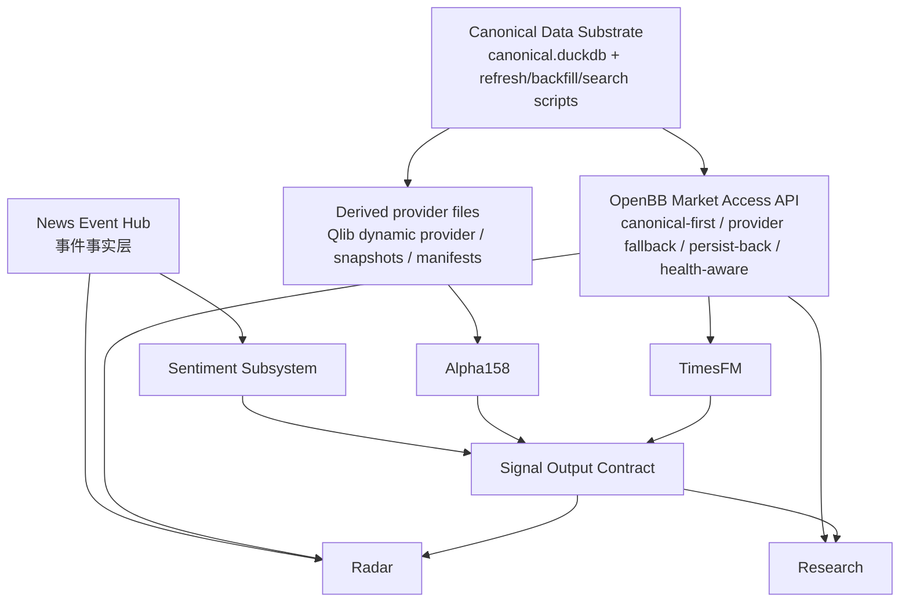

# Fact + Signal Target Architecture V1

## 1. 目标

把当前 `Radar / Research / qlib` 对上游数据的混合访问，收敛成一套更清晰、可持续的目标架构：

- `News Event Hub` 负责事件事实
- `canonical 数据底座` 负责市场事实
- `OpenBB API` 负责对外供给市场事实
- `量化子系统` 负责产出信号
- `Radar / Research` 同时消费 `事件事实 + 市场事实 + 信号`

这份文档只回答两个问题：

1. `OpenBB API` 到底应该承担什么职责
2. `Alpha158 / Sentiment / TimesFM` 这些信号应该如何对外供给

## 2. 结论

结论先说清楚：

- 你的方向是对的，最终应该尽量收敛到：
  - `canonical 数据库 + 刷新/补抓/搜索脚本`
  - `OpenBB API`
  - `signal outputs`
  - `Radar / Research / qlib`
- 但这里有一个关键修正：
  - `OpenBB API` 最好统一供给 **事实数据**
  - `Alpha158 / Sentiment / TimesFM` 最好统一供给 **信号数据**
- 所以最终不是一层，而是两层：
  - `fact plane`
  - `signal plane`

## 3. 最终目标图

## 4. 事实层：OpenBB API 应该承担什么

### 4.1 外部口径

对下游来说，最理想的口径是：

`市场事实都通过 OpenBB API 读取。`

也就是说：

- Radar 不自己选 `AKShare / yfinance`
- Research 不自己决定 fallback provider
- 下游不直接碰 `canonical.duckdb`

### 4.2 内部实现

但对系统内部来说，不能把“OpenBB API”简单理解成今天那个裸的 `openbb-api.service`。

当前真实情况是：

- `openbb-api.service`
  - 更像 provider / remote HTTP 能力层
- `../scripts/openbb_adapter.py`
  - 才是当前真正具备：
    - `canonical-first`
    - `provider fallback`
    - `persist-back`
    的访问门面雏形

所以最终应该收敛成：

`OpenBB API = 对外 contract`
`OpenBB market access facade = 对内实现`

换句话说：

- 对下游，统一表现为 `OpenBB API`
- 对内部，允许它背后有一个更强的 `market access facade`

### 4.3 这个访问层必须具备的能力

如果要让 Research / Radar 不自己处理 provider 细节，这层必须明确承担下面这些职责：

1. `canonical-first read`
- 先查 canonical DB / canonical exports
- 有数据直接返回

2. `provider routing`
- A 股优先走 A 股 provider
- 港股优先走港股 provider
- 海外资产优先走相应 provider

3. `provider fallback`
- 主 provider 失败时自动切换到备用 provider
- 不是把 provider 异常直接裸传给下游

4. `retry / timeout / circuit-break`
- 对临时网络问题做重试
- 对长期坏掉的 provider 做熔断或降级

5. `search / backfill on demand`
- canonical 没有该标的或该日期数据时
- 能按 symbol / market / field 主动补抓

6. `persist-back`
- 补抓成功后写回 canonical
- 如果 canonical 当前被锁住，进入 deferred queue，后续自动 flush

7. `freshness + coverage aware`
- 不只看“整表最大日期”
- 还要看：
  - lane-level freshness
  - symbol-level freshness
  - coverage completeness

8. `structured error contract`
- 返回的不应该只是原始 provider 报错
- 应该能区分：
  - `not_found`
  - `temporarily_unavailable`
  - `coverage_gap`
  - `writeback_deferred`
  - `provider_degraded`

### 4.4 对你第一个问题的直接回答

你问的是：

`OpenBB 本身能不能自主路由到 AKShare 还是 yfinance？`
`如果 yfinance 没数据，它会不会自动尝试 AKShare？`

当前答案是：

- `裸 openbb-api.service` 不应该被假设成已经具备这种完整自愈能力
- 当前真正做这件事的是 `openbb_adapter.py`

所以如果我们沿你的目标收敛，最合理的做法不是让：

- Research 自己判断 provider

而是让：

- `OpenBB market access facade`
  统一承担这层判断和修复

也就是说：

`不让 Research 介入 provider routing，是对的。`
`但前提是 OpenBB 访问层自己必须变成一个更强的 orchestrator。`

## 5. 信号层：如何供给下游

### 5.1 为什么不能和事实层混成一层

`行情 / 财务 / 资金面` 和 `Alpha158 / Sentiment / TimesFM` 的治理方式不同。

事实层关注：

- freshness
- coverage
- writeback
- canonical truth

信号层关注：

- model version
- generation time
- feature window
- explainability
- output semantics

所以更合理的做法是：

- `OpenBB API` 供给事实层
- `Signal Output Contract` 供给信号层

### 5.2 信号层建议的统一 contract

目前最好的统一口径，仍然是 `qlib_paper_trading/docs/multi_subsystem_quant_architecture.md` 里已经开始定义的这几类：

1. `instrument_score_snapshot`
2. `market_snapshot`
3. `research_snapshot`
4. `forecast_curve`
5. `paper_trading_snapshot`

我建议把各子系统的对外供给压成下面这张表：

| 子系统 | 类型 | 对外主产物 | 主要消费者 |
| --- | --- | --- | --- |
| `Alpha158` | `execution_score` | `instrument_score_snapshot` | `Research`, 组合层 |
| `Sentiment` | `reference_signal` | `market_snapshot`, `research_snapshot` | `Radar`, `Research` |
| `TimesFM` | `forecast_signal` | `market_snapshot`, `research_snapshot`, `forecast_curve` | `Research` |

### 5.3 各子系统建议的供给方式

#### `Alpha158`

- 不建议直接走 OpenBB API
- 它更适合继续读取 canonical 派生出来的专用 provider / 文件
- 对外输出：
  - `instrument_score_snapshot`
  - 单股 `research_lookup`

#### `Sentiment`

- 读取：
  - canonical 市场事实
  - News Event Hub 事件事实
- 输出：
  - `market_snapshot`
  - `research_snapshot`
  - 必要时 `event sentiment long table`

#### `TimesFM`

- 读取：
  - OpenBB API 的历史行情 / 指数 / 流动性序列
- 输出：
  - `forecast_curve`
  - `market_snapshot`
  - 单公司 `research_snapshot`

### 5.4 下游查询接口应该怎么设计

我建议信号层不要再让每个下游各自找文件，而是逐步收成一个统一查询口径。

短期可接受：

- 统一目录 + manifest + schema
- 例如：
  - `/opt/quant-runtime/output/subsystems/<subsystem>/market/...`
  - `/opt/quant-runtime/output/subsystems/<subsystem>/instruments/...`

中期更合理：

- 增加一个 `signal access facade`
- 至少支持：
  - `get_latest_market_signal(subsystem, market, signal_name)`
  - `get_latest_instrument_signal(subsystem, instrument, signal_name)`
  - `get_signal_history(subsystem, instrument_or_market, signal_name, start, end)`
  - `get_research_snapshot(subsystem, instrument)`

也就是说：

- 事实层统一走 `OpenBB API`
- 信号层统一走 `signal access facade`

## 6. 消费层怎么接

### `Radar`

应读取：

- `News Event Hub`
- `OpenBB API` 市场事实
- `Sentiment` 信号
- 未来可按需接 `Alpha158` 和 `TimesFM` 的辅助信号

Radar 不应该：

- 自己决定 provider
- 自己直连 DuckDB
- 自己维护独立事实抓取逻辑

### `Research`

应读取：

- `OpenBB API` 市场事实
- `Alpha158 / Sentiment / TimesFM` 信号
- `News Event Hub` 事件事实

Research 不应该：

- 自己决定 `AKShare / yfinance`
- 自己负责 canonical 写回

### `qlib / Alpha158`

应继续：

- 读取 canonical 派生 provider / 文件

不强求：

- 直接走 OpenBB API

因为它更偏训练/执行基座，而不是交互式数据查询消费者。

## 7. 从当前状态往目标收敛

### 7.1 第一阶段：明确角色

- `canonical 数据库 + 刷新/补抓/搜索脚本`
  - 明确是市场事实底座
- `News Event Hub`
  - 明确是事件事实底座
- `OpenBB market access facade`
  - 明确是市场事实访问层
- `signal outputs`
  - 明确是信号供给层

### 7.2 第二阶段：统一访问

- Radar / Research 不再各自 direct read canonical
- provider fallback 全收进 `OpenBB market access facade`

### 7.3 第三阶段：统一信号查询

- 把 `Alpha158 / Sentiment / TimesFM` 的输出 contract 固定下来
- 再在这之上增加统一查询层

## 8. 最终判断

如果把你的问题压成一句话，我的判断是：

`是，我们应该把系统收敛成“事件事实层 + 市场事实层 + 信号层 + 消费层”这四层结构。`

更具体地说：

- `新闻系统` 独立提供事件事实
- `canonical 数据底座` 独立提供市场事实
- `OpenBB API` 统一提供市场事实访问
- `量化子系统` 独立提供信号输出
- `Radar / Research` 同时消费事实和信号

而且：

`Research 不应该自己选 provider。`
`OpenBB 访问层必须自己承担 routing / fallback / persist-back / error handling。`

这就是我们接下来该继续收敛的方向。
